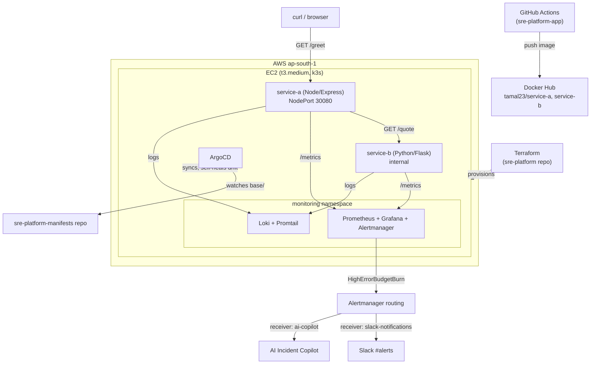

## Architecture

# on WSL2 (tamal@Mrinal)
git clone https://github.com/Tamal-tm/sre-platform.git
cd sre-platform/terraform
terraform init
terraform apply   # creates VPC, subnet, SG, EC2 (t3.medium), Elastic IP, S3 backend + DynamoDB lock

# SSH in and verify k3s
ssh -i <your-key>.pem ubuntu@<elastic-ip>
sudo k3s kubectl get nodes

# Bootstrap ArgoCD
kubectl create namespace argocd
kubectl apply -n argocd -f https://raw.githubusercontent.com/argoproj/argo-cd/stable/manifests/install.yaml
kubectl apply -f argocd-app.yaml   # Application watching sre-platform-manifests repo's base/ path

# Install observability stack (namespace: monitoring, NOT sre-platform)
export KUBECONFIG=/etc/rancher/k3s/k3s.yaml
helm repo add prometheus-community https://prometheus-community.github.io/helm-charts
helm repo add grafana https://grafana.github.io/helm-charts
helm install monitoring prometheus-community/kube-prometheus-stack -n monitoring --create-namespace
helm install loki grafana/loki-stack -n monitoring --set loki.image.tag=2.9.8

# Verify
kubectl get pods -n sre-platform
kubectl get pods -n monitoring
curl http://<elastic-ip>:30080/greet

## Teardown & Cost — sre-platform

Single t3.medium EC2 instance (~$0.0416/hr in ap-south-1, ~$30/month if left
running continuously). Stopped, not destroyed, between sessions — preserves
EBS volume and k3s state at $0 compute cost (only ~$0.08/GB-month EBS storage).

\`\`\`bash
# Stop between sessions (no compute charge, state preserved)
aws ec2 stop-instances --instance-ids <instance-id>

# Resume a session
aws ec2 start-instances --instance-ids <instance-id>

# Full teardown (only if permanently done)
cd terraform && terraform destroy
\`\`\`

**Note:** the EC2 Security Group's SSH rule was temporarily widened to
0.0.0.0/0 on port 22 during Day 6 due to a dynamic home ISP IP repeatedly
invalidating the rule. This should be narrowed back down (or the instance
torn down) before treating this as anything beyond a personal portfolio
sandbox.
