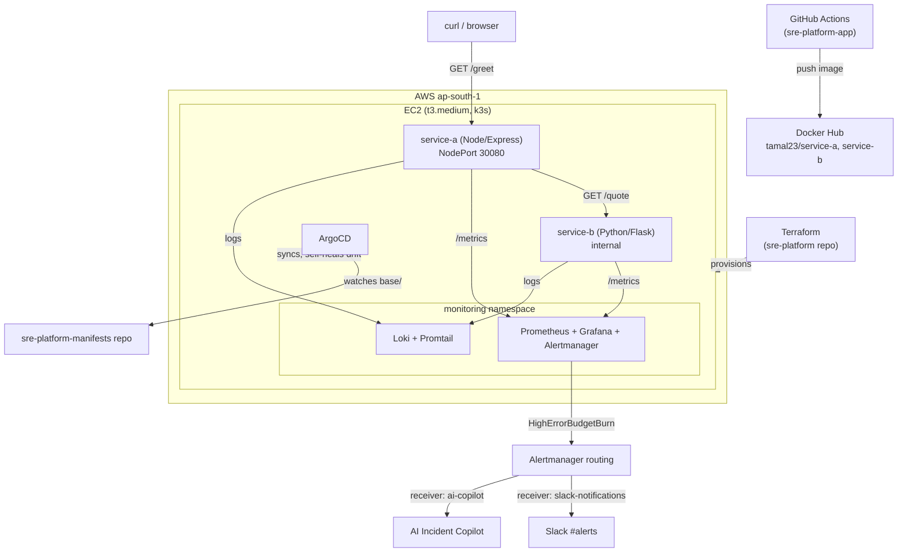

## Repo structure

This project is split across four repos, following a GitOps pattern:

| Repo | Contains | Role |
|---|---|---|
| [`sre-platform`](https://github.com/Tamal-tm/sre-platform) | Terraform (VPC, EC2, SG, EIP, S3 remote state), k3s/ArgoCD bootstrap | Infra-as-code — provisions the foundation everything else runs on |
| [`sre-platform-app`](https://github.com/Tamal-tm/sre-platform-app) | `service-a`, `service-b` source code, SLO definition | Application code — the two services being observed |
| [`sre-platform-manifests`](https://github.com/Tamal-tm/sre-platform-manifests) | Kubernetes manifests (Deployments, Services, PrometheusRules) | Deployment source of truth — ArgoCD watches this repo and syncs the cluster to match it |
| [`ai-incident-copilot`](https://github.com/Tamal-tm/ai-incident-copilot) | Lambda (container image), Terraform for API Gateway/Lambda, FAISS + runbooks | Consumes Project 1's alerts via Alertmanager webhook, auto-generates an AI diagnosis in Slack |

**Why split this way:** it mirrors how a real GitOps setup separates concerns — infra provisioning, application code, and *desired cluster state* are three different lifecycles with three different change cadences. `sre-platform-manifests` in particular exists as its own repo specifically because ArgoCD needs a Git source to reconcile against that's independent of where the application code itself lives — that's what makes it "GitOps" rather than just "CI/CD."

## Architecture




```markdown
## Deployment Steps (WSL2)

1. **Clone the repo and provision infra**
   ```bash
   git clone https://github.com/Tamal-tm/sre-platform.git
   cd sre-platform/terraform
   terraform init
   terraform apply   # creates VPC, subnet, SG, EC2 (t3.medium), Elastic IP, S3 backend + DynamoDB lock
   ```

2. **SSH into EC2 and verify k3s**
   ```bash
   ssh -i <your-key>.pem ubuntu@<elastic-ip>
   sudo k3s kubectl get nodes
   ```

3. **Bootstrap ArgoCD**
   ```bash
   kubectl create namespace argocd
   kubectl apply -n argocd -f https://raw.githubusercontent.com/argoproj/argo-cd/stable/manifests/install.yaml
   kubectl apply -f argocd-app.yaml   # Application watching sre-platform-manifests repo's base/ path
   ```

4. **Install observability stack (namespace: monitoring)**
   ```bash
   export KUBECONFIG=/etc/rancher/k3s/k3s.yaml
   helm repo add prometheus-community https://prometheus-community.github.io/helm-charts
   helm repo add grafana https://grafana.github.io/helm-charts
   helm install monitoring prometheus-community/kube-prometheus-stack -n monitoring --create-namespace
   helm install loki grafana/loki-stack -n monitoring --set loki.image.tag=2.9.8
   ```

5. **Verify deployments**
   ```bash
   kubectl get pods -n sre-platform
   kubectl get pods -n monitoring
   curl http://<elastic-ip>:30080/greet
   ```

6. **Teardown & Cost — sre-platform**
   - Single **t3.medium EC2 instance** (~$0.0416/hr in ap-south-1, ~$30/month if left running continuously).  
   - Stopped, not destroyed, between sessions — preserves EBS volume and k3s state at $0 compute cost (only ~$0.08/GB-month EBS storage).

   ```bash
   # Stop between sessions (no compute charge, state preserved)
   aws ec2 stop-instances --instance-ids <instance-id>

   # Resume a session
   aws ec2 start-instances --instance-ids <instance-id>

   # Full teardown (only if permanently done)
   cd terraform && terraform destroy
   ```

   **Note:** The EC2 Security Group’s SSH rule was temporarily widened to `0.0.0.0/0` on port 22 during Day 6 due to a dynamic home ISP IP repeatedly invalidating the rule. This should be narrowed back down (or the instance torn down) before treating this as anything beyond a personal portfolio sandbox.
```
